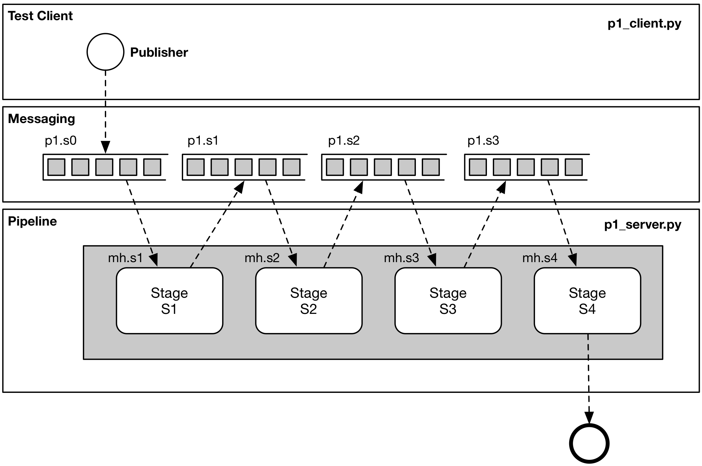

# Python-Nats Pipeline Exploration

## Overview

[**STATUS**: DEV / ALPHA]

Project to explore the use of python + nats to implement a scalable, low latency, distributed, computational pipeline 
using Python Asyncio and NATS.io. 

The aim is to develop a generic implementation to:

1. Explore the effect of synchronous code in pipeline efficiciency.
2. Explore the effect of allocating finite resources across pipeline stages.
3. Provide source data to enable a structured analysis approach to be built.
4. Provide insight into pipeline optimisation strategy.

The example pipeline has been kept deliberately generic.  Namely a pipeline _Pn_ is composed of 4 sequential stages, 
_S1_ .. _S4_.  Each stage taking a defined amount of time.



Five separate versions of the pipeline have been implemented:

P0 - No messaging, in-process, sequential implementation to provide a benchmark to assess subsequent implementations.

P1 - Implemented as a single process with synchronous / blocking calls within each stage.

P2 - Implemented with all blocking calls replaced with asynchronous non-blocking equivalients. 

P3 - Implemented with each stage having its own dedicated process.

P4 - Implemented with each stage having 1 or more dedicated processes.

## Future

* Implement with a dockerised version of RabbitMQ for comparison
* Implement with a dockerised version of Kafka for comparison
* Implement using Docker Compose / Kubernetes to explore pipeline containerisation.
* Build a DSL for Pipeline and Stage construction.
* Build production-ready version to include enhanced monitoring / logging etc. 
* Use the project as part of broader research / teaching projects.
* For completeness implement multiple process pipeline with sync calls (1 per stage, 1+ per stage)?
* ???

## Summary findings

1. NATS.io & Python provide an easy route to implement a Staged message driven pipeline.
2. The stages can be easily implemented in process or using multiple processes over 1 or more nodes.
3. To improve pipeline efficiency / performance:
- Implement logging to support pipeline analysis.
- Baseline sequential in-process performance.
- Baseline initial / current pipeline version.
- Identify and remediate blocking parts of each stage.
- Separate processes for each stage.
- Experiment with different scaling options across each pipeline stage.  [More to follow.]

See Log Analysis workbook for more detailed analysis.

## Notes
1. NATS.io provides limited delivery guarantees (at most once).
2. Durability requirements may necessitate evaluation of alternatives depending on the use-case.
3. There is an open issue re the resolution of asyncio wrt time [https://bugs.python.org/issue31539]
this manifests as some of the analysis showing stages taking less than their defined minimum durations.

## Setup
1. Requires a running NATS server either in the cloud, local or docker.
2. Docker image can be started using:

```bash
docker run -p 4222:4222 -p 8222:8222 -p 6222:6222 --name gnatsd -ti nats:latest
``` 

## References
[1] (http://usingcsp.com/cspbook.pdf) "Communicating Sequential Processes"   
[2] "Enterprise Integration Patterns - Hohpe and Woolf"
 